# FarmApplication

REST приложение с микросервисной архитектурой для автоматизации работы с 
отчетамии на ферме

**Микросервис владельца:** https://github.com/IlyushaShulenin/FarmOwnerApi.git

**Микросервис работника:** https://github.com/IlyushaShulenin/FarmWorkerApi.git

----

## Стек технологий
### Из обязательных

- Java 17;
- Spring Boot 3;

### Из рекомендуемых

- Spring Security;
- JWT;
- Spring Data;
- PostgreSQL;
- Redis;
- Kafka;
- Docker;
- JSON;

### Дополнительные

- Liquibase для версионирования баз данных;

----

## Реализованный функционал

### Для владельца фермы

- Добавление новых продуктов;
- Удаление продуктов;
- Начисление баллов работнику;
- Удаление баллов работника;
- Создание плана для работника на день;
- Удаление плана
- Получение информации об объемах полученной продукции в сравнении с запланированным
    - В целом по ферме
    - Для заданного рабочего;
    - Для заданного рабочего за указанный месяц;
    - Получение данных в письма на электронную почту владельца;
- Аутентификация владельца с помощью JWT токена;
- Кэширование данных с помощью Redis;

### Для работника

- Создание отчета о проделанной работе и отправка его владельцу с помощью Kafka
- Аутентификация рабочего;
- Получение персольнальной информации для аутентифицированного пользователя:
    - Не закрытые планы планы;
    - Начисленные баллы
    - Данные о произведенной продукции в сравнении с заданными планами
        - За все время;
        - За заданный месяц;
    
# Демонстрация работы

---

## FarmOwnerApi
Микросервис, отвечающий за работу на стороне владельца фермы

---

### Аутентификация владельца фермы

Данные владельца:

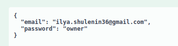

Полученный JWT токен:

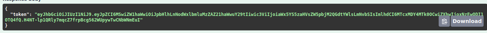

### Получить список всех рабочих

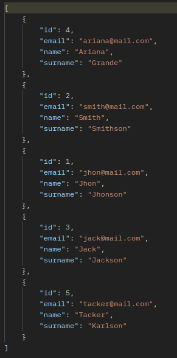

При создании бина workerService внутри него инициализируется Redis Repository
и при этом заполняется данными полученными из основной БД, поэтому при запросе данные о рабочих
достаются из кэша.

### Получить рабочего по id

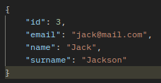

Проверяется наличие данные о рабочем в кэше. Если там его нет, то проверяется БД. При обнаружении
нужного рабочего, он записывается к кэш и возвращается в качестве результата. Иначе - исключение.

### Зарегистрировать нового рабочего

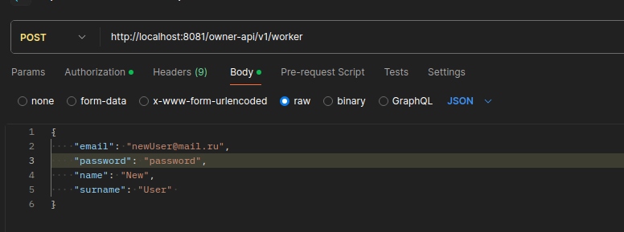

Результат запроса:

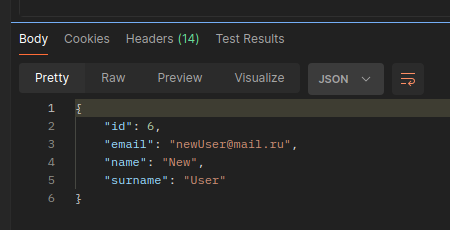

При регистрации рабочего указываеются уникальный email, пароль для входа, имя, фамилия.
Поле isWorking по умолчанию инициализируется значением true. Поле означает,что работник трудится на ферме.
В случае увольнение рабочего поле принимает значение false, это необходимо для сохранения планов и отчетов уволенного 
сотрудника.

При выполнении запроса переданные данные с помощью Kafka отправляются на микросервис FarmWorkerApi и сохраняются
в БД.

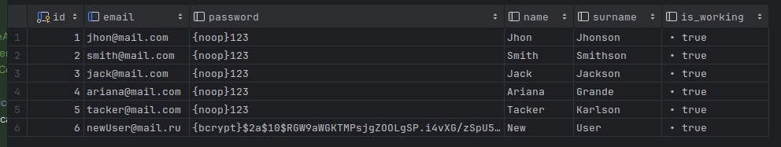

### Увольнение рабочего

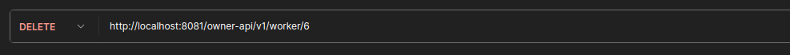

При увольнениии рабочего isWorking меняет значение с true на false. В дальнейшем, при получении данных о всех рабочих,  
он не будет отображаться. Так же этот рабочий не будет доступен по id и не сможет заходить в FarmWorkerApi.

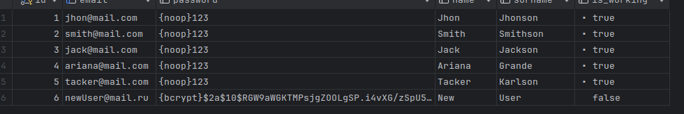

### Получение списка всех продуктов

По аналогии с workerService все продукты достаются из кэша.

### Получение продукта по id

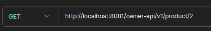

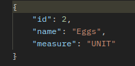

### Добавление нового продукта

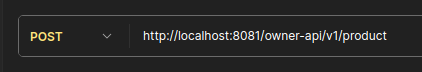

Тело запроса

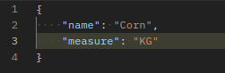

Результат запроса

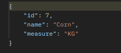

При добавлении нового продукта он сохраняется в БД и отправляется сообщение на FarmWorkerApi
и там тоже сохраняется в БД. По умолчанию поле isProduced принимает значение true и обозначает, что продукт производится.
При удалении продукта isProduced становится false.

БД на стороне FarmWorkerApi

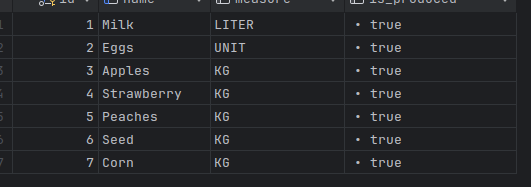

### Удаление продукта

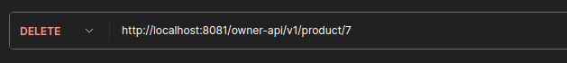

isProduced становится false при этом сохраняются планы и отчеты для данного продукта

БД на стороне FarmWorkerApi

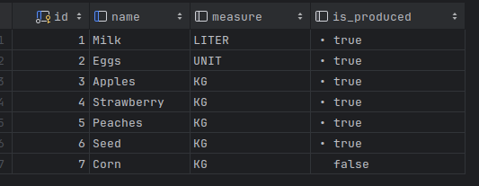

### Получение списка всех планов

Все планы достаются из кэша

Полученный список содержит информацию о рабочем, о продукте, необходимый объем и дату

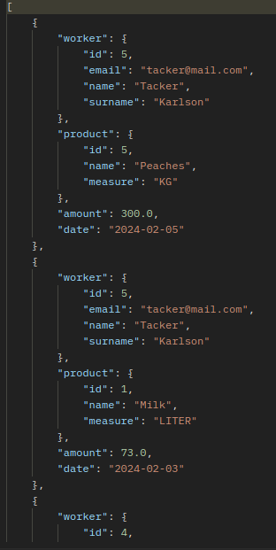

### Получение плана по id

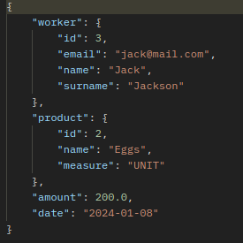

### Создание нового плана

Тело запроса

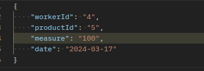

Результат запроса

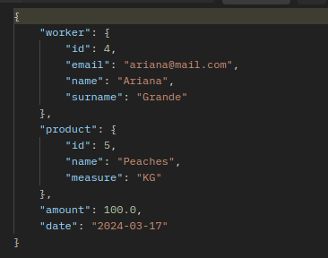

Новый план сохраняется и на стороне FarmWorkerApi

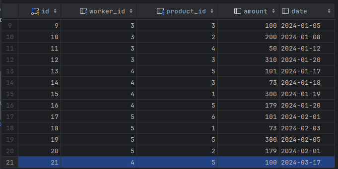

### Удаление плана

При удалении плана на FarmWorkerApi отправляется сообщение.

БД на стороне FarmWorkerApi

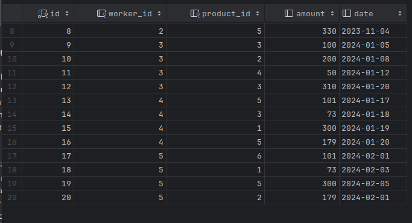

### Получение списка всех баллов

Баллы достаются из кэша

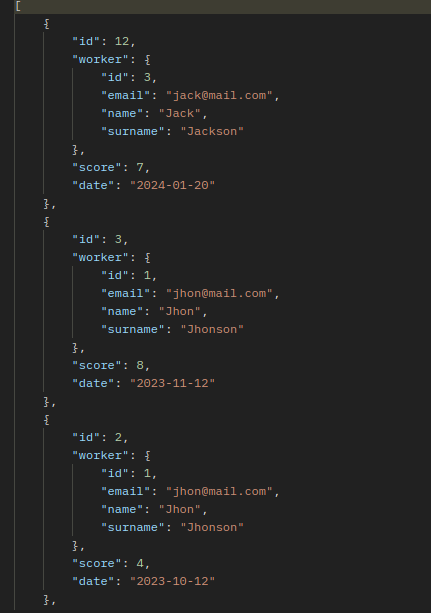

### Получение баллов по id

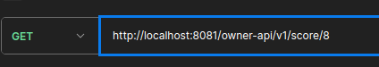

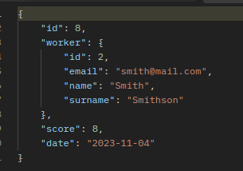

### Добавление баллов рабочему

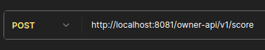

Тело запроса 

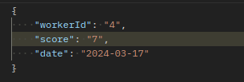

Результат запроса

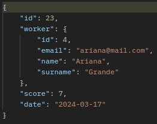

Баллы сохраняются в БД у FarmWorkerApi

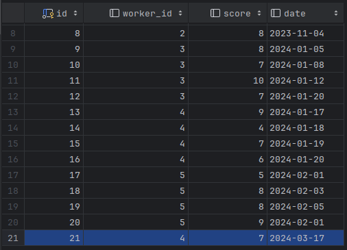

### Удаление баллов по id

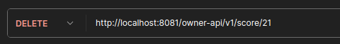

Баллы удаляются в том числе и на стороне рабочего

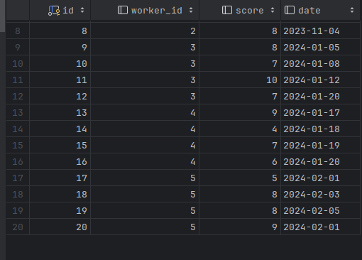

### Получение продуктивности рабочего

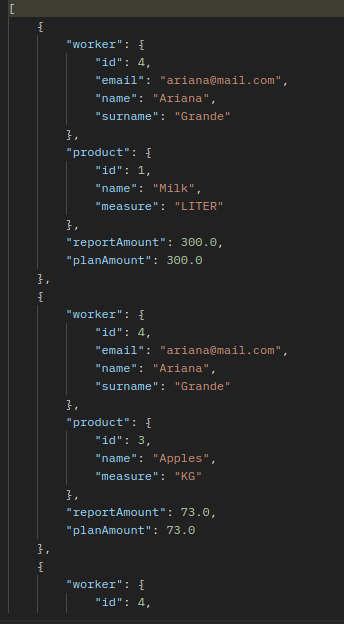

### Отправка отчетности на почту

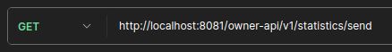

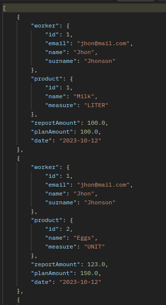

---

## FarmWorkerApi

Микровсервис, отвечающий за работу на стороне рабочего.

---

### Аутентификация рабочего

Данные рабочего

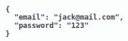

Сгенерированный JWT токен

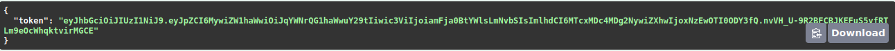

### Составление отчета

Тело запроса

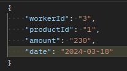

Результат запроса

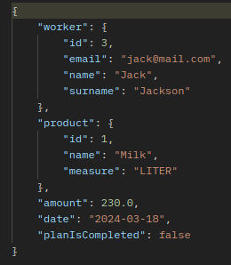

После сохранения отчета на стороне FarmWorkerApi на сторону владельца отправляется сообщение,
содержащее данные из отчета. Поле planIsCompleted принимает значение true, если план по заданному продукту
и в заданный день выполнен, иначе false(в том числе если соответствующего плана нет).

БД у владельца:

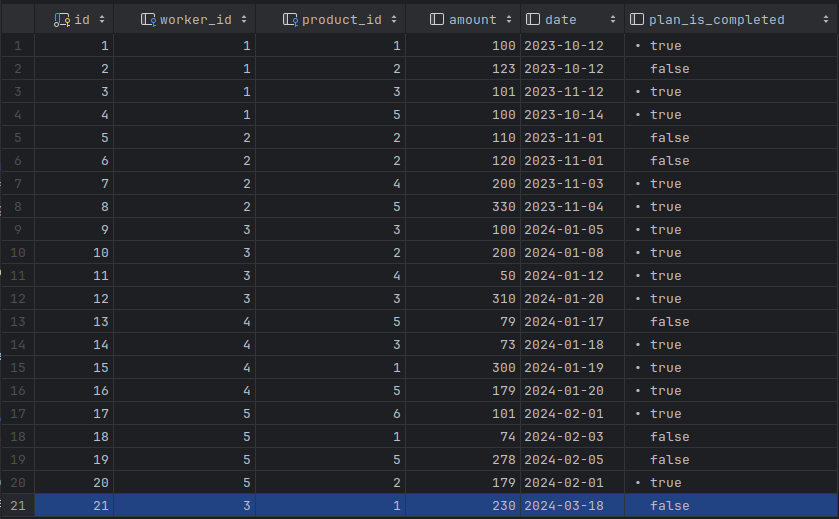

### Получение отчетности для аутентифицированного рабочего

Незакрытые планы рабочего:

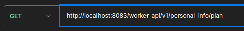

Ответ:

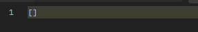

Ответ пуст так как для вошедшего рабочего все планы закрыты.

Баллы рабочего:

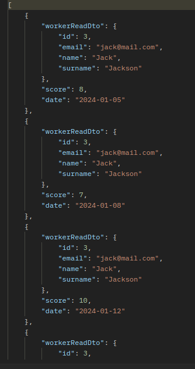

Отчетность по продуктивности рабочего:

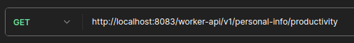

Ответ:

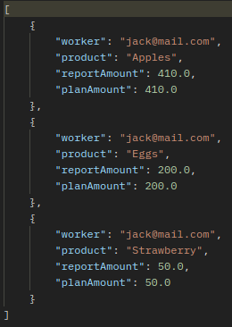

# PS

Видео снять не получилось, так как мой несчастный ноутбук не вывозит такую "сумасшедшую" нагрузку(.

